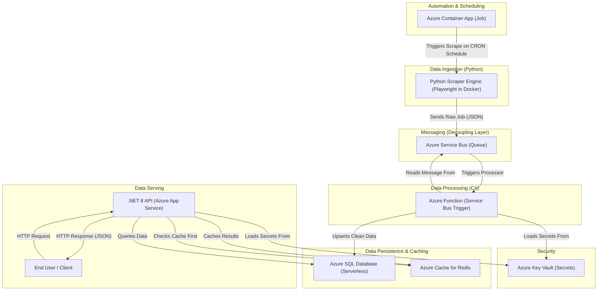

# 🚀 Jobvago - A Cloud-Native Job Aggregation Platform

Jobvago is a fully automated, event-driven, and serverless application built on Microsoft Azure that scrapes job postings from multiple sources, processes them, and serves them via a clean REST API. It's a demonstration of modern backend architecture, designed for scalability, resilience, and security.

---

## 🏛️ High-Level Architecture

The entire system is designed around a decoupled, event-driven philosophy. No component talks directly to the next; instead, they communicate through a central message queue. This ensures that if one part of the system fails or slows down, the others are not affected.

---

## 🔧 Technology Stack

*   **Cloud Platform:** Microsoft Azure
*   **Backend API:** C# with .NET 8 on Azure App Service
*   **Data Processing:** C# Azure Functions (.NET Isolated Worker Model)
*   **Scraping & Scheduling:** Python script in a **Docker** container, run by a scheduled **Azure Container App Job**.
*   **Database:** Azure SQL Database (Serverless Tier)
*   **Messaging:** Azure Service Bus (Queue)
*   **Caching:** Azure Cache for Redis
*   **Secrets Management:** Azure Key Vault & .NET User Secrets
*   **Scraping Library:** Playwright
*   **ORM:** Entity Framework Core 8
*   **Data Validation (Python):** Pydantic

---

## 🧠 Component Deep-Dive & Design Decisions

Each component was designed with specific principles in mind.

### 1. The Scheduler (`jobvago-scheduler`)

This component kicks off the entire process.

*   **Implementation:** A **scheduled Azure Container App Job** that runs a Docker container on a CRON schedule.
*   **Design Decision: The Evolution from Azure Functions to Container Apps**
    *   **Initial Choice:** We began with a Python Azure Function on a Timer Trigger. This is ideal for simple, lightweight scheduled tasks due to its serverless nature and low cost.
    *   **The Problem:** The scraping engine requires Playwright and a full browser engine (Chromium), which are large, complex dependencies. The standard Azure Functions environment, especially on the Consumption plan, has limitations on package size and startup time. This resulted in repeated deployment and runtime failures—the environment was too constrained for our specific needs.
    *   **The Solution:** We migrated to Azure Container Apps. This approach allows us to define the *exact* runtime environment using a `Dockerfile`. We build an image that includes Python, all `pip` packages, **and the Playwright browser dependencies**. The Container App Job simply runs this pre-built, guaranteed-to-work container.
    *   **The Benefit:** This gives us the best of both worlds: the complete environmental control of a dedicated server, but with the cost-effective, serverless model of paying only for the time the job is running. It is the modern, robust solution for running containerized, scheduled tasks in Azure.

### 2. The Scraper Engine (`run_scraper.py`)

This is the core data collection engine running inside the container.

*   **Design Decision:** Why Playwright over Scrapy?
    *   **Trade-off:** Scrapy is incredibly fast for crawling simple, static HTML. However, modern websites (like Naukri.com) are dynamic web applications that heavily rely on JavaScript to load content.
    *   **Choice:** Playwright was chosen because it automates a real browser engine (Chromium). This allows it to handle complex JavaScript, deal with pop-ups, and interact with the page like a real user, making it far more robust and capable for the modern web, at the cost of being slightly slower than a pure HTTP-based crawler.
*   **Design Decision:** The **Strategy & Factory Patterns**.
    *   Initially, the main script was hardcoded for one site. This was brittle.
    *   We refactored this by defining a `ScraperStrategy` abstract base class (the "contract"). Each scraper (`InternshalaScraper`) is a concrete implementation of this strategy.
    *   A `scraper_factory` function was created to dynamically load and instantiate the correct scraper based on a configuration file. This makes the system **extensible**. To add a new site, we simply create a new scraper class and update the config; the orchestrator code doesn't change.
*   **Design Decision:** Self-Sufficient Scrapers (The `discover_jobs` Refactor).
    *   The orchestrator initially handled pagination logic, which was not scalable, as different sites have different pagination methods (page numbers vs. "Load More" buttons).
    *   We refactored the design to make each scraper fully responsible for its own pagination. The `discover_jobs` method is an **async generator** (`yield`) that discovers jobs and yields them one by one, hiding the implementation details from the orchestrator. This is a much cleaner, more decoupled design.

### 3. The Message Queue (`Azure Service Bus`)

This is the architectural lynchpin of the entire system.

*   **Implementation:** An Azure Service Bus Queue named `new-jobs-queue`.
*   **Design Decision:** Why use a queue instead of calling the processor directly?
    *   **Decoupling (Most Important):** The scraper's job ends when it drops a message in the queue. It knows nothing about the database or the processor. If we need to change the database or rewrite the processor in a different language, the scraper is completely unaffected.
    *   **Resilience:** If the processor function or the database is down for maintenance, messages simply pile up safely in the queue. Once the downstream systems are back online, they process the backlog. **No data is lost.**
    *   **Load Leveling:** If the scrapers find 50,000 jobs in a 5-minute burst, they can all be rapidly sent to the queue. The processor function can then consume them at a steady, manageable pace, preventing the database from being overwhelmed.

#### Screenshot of Service Bus Queue
`[YOUR-SCREENSHOT-HERE - A picture of the 'new-jobs-queue' in the Azure Portal, showing some active messages if possible]`

### 4. The Data Processor (`jobvago-processor`)

This is the "assembly station" that ensures data quality.

*   **Implementation:** A C# Azure Function with a **Service Bus Trigger** running on the modern **.NET Isolated Worker Model**.
*   **Design Decision:** Why `.NET Isolated Worker`?
    *   This is the current Microsoft standard. It runs our function code in a separate process from the Functions host, giving us full control over dependencies and avoiding version conflicts. This was a critical lesson learned during development.
*   **Key Logic: "Upsert" and Transactions**
    *   To maintain data integrity, the function doesn't blindly insert data. For entities like `Company`, it uses a "Get-or-Create" (Upsert) pattern to avoid duplicates.
    *   The entire set of database operations for a single message is wrapped in a **database transaction**. If any part fails (e.g., the job insert fails after a new company was created), the entire transaction is rolled back, leaving the database in a clean, consistent state. This is non-negotiable for professional data processing.

### 5. The Database (`Azure SQL Database`)

This is our structured "warehouse."

*   **Implementation:** Azure SQL Database on the **Serverless Tier**.
*   **Design Decision:** Why SQL over NoSQL?
    *   The data we are collecting is highly structured and relational (Jobs belong to Companies, have Locations, etc.). A relational database like SQL Server allows us to enforce data integrity with foreign keys and perform powerful, efficient `JOIN` queries.
*   **Design Decision:** Why the Serverless Tier?
    *   **Cost-Effectiveness:** For a project with intermittent workloads like ours, the serverless tier is perfect. It can automatically scale down to zero and **auto-pause** when not in use, dramatically reducing costs.
*   **Schema Design:** The schema is highly **normalized** to reduce data redundancy and improve integrity (The DRY Principle - Don't Repeat Yourself). We use lookup tables (`Companies`, `Locations`, `Skills`) and linking tables (`JobLocations`, `JobSkills`) to model many-to-many relationships efficiently.
*   **Performance:** Non-clustered indexes were explicitly created on foreign key columns (`CompanyID`, `SourceID`, etc.) to dramatically speed up query performance as the `Jobs` table grows.

#### Screenshot of Database Schema
`[YOUR-SCREENSHOT-HERE - A picture from VS Code or Azure Data Studio showing the database tables and their relationships]`

### 6. The API Layer (`jobvago-api`)

The public "shipping department" for our data.

*   **Implementation:** An ASP.NET Core 8 Web API hosted on **Azure App Service**.
*   **Design Decision:** Why a separate API?
    *   This follows the **Single Responsibility Principle**. The API's only job is to handle HTTP requests, apply business logic, and serve data. It is decoupled from the data ingestion pipeline.
*   **Key Technology: Entity Framework Core 8**
    *   EF Core acts as our Object-Relational Mapper (ORM), translating our C# LINQ queries (e.g., `_context.Jobs.ToListAsync()`) into efficient, parameterized SQL. This improves developer productivity and provides automatic protection against SQL Injection attacks.

---

## 🛡️ Security: The Journey to a Password-less Architecture

Handling secrets is one of the most critical aspects of professional software development.

1.  **Anti-Pattern (Initial Mistake):** The database connection string was accidentally committed to `appsettings.json` and pushed to GitHub. This is a critical security flaw.
2.  **Remediation:** The secret was immediately invalidated by resetting the database password in Azure.
3.  **Local Development Solution:** We implemented **.NET User Secrets**. This tool stores secrets in a secure JSON file *outside* the project folder, so they can never be accidentally committed to Git.
4.  **Production Solution (The Gold Standard):** We integrated **Azure Key Vault**.
    *   All secrets (like the SQL connection string) are stored centrally and securely in Key Vault.
    *   The deployed Azure services (the App Service and Function Apps) are given a **Managed Identity**, which is like an automated, secure ID card from Azure AD.
    *   We create an **Access Policy** in Key Vault that grants this Managed Identity permission to read secrets.
    *   The application code uses the `DefaultAzureCredential()` library, which automatically authenticates using its Managed Identity. The result is a **passwordless architecture**. The code contains no secrets, the configuration contains no secrets, and authentication is handled securely and automatically by the Azure platform.

#### Screenshot of Key Vault
`[YOUR-SCREENSHOT-HERE - A picture of your Azure Key Vault homepage]`

---

## ⚡ Performance: Caching with Redis

To ensure the API is fast and responsive, and to reduce load on the database, a caching layer was implemented.

*   **Implementation:** An **Azure Cache for Redis** instance.
*   **Pattern:** The **Cache-Aside Pattern** was used in the .NET API.
    1.  When a request for data arrives, the API first checks Redis for the result.
    2.  **Cache Hit:** If the data is in Redis, it's returned instantly to the user without touching the database.
    3.  **Cache Miss:** If the data is not in Redis, the API queries the SQL database, returns the result to the user, and simultaneously saves that result in Redis for subsequent requests.

This dramatically improves performance for frequently accessed data and enhances the scalability of the application.

#### Screenshot of Redis Cache
`[YOUR-SCREENSHOT-HERE - A picture of your Azure Cache for Redis homepage]`

---

## ☁️ Final Deployed Azure Resources

`[YOUR-SCREENSHOT-HERE - A picture of your 'Jobvago-RG' Resource Group in the Azure Portal, showing the list of all created services: App Service, Function Apps, SQL Server, Service Bus, Redis, Key Vault, etc.]`

---

## 📈 Future Improvements

No project is ever truly finished. Here are the next logical steps to enhance `Jobvago`:

*   **Implement CI/CD:** Create GitHub Actions workflows to fully automate the testing and deployment of all three components (API, Processor, Scheduler).
*   **Add More Scrapers:** Leverage the extensible factory pattern to add scrapers for other sites like LinkedIn, Naukri, etc.
*   **User Account Management:** Embed User Account Management allowing them to create profiles, upload resumes, setup push notifications for new jobs etc.
*   **AI Integration:** AI (with RAG capabilities) can analyse resume, give ATS scores to them, shortlist most compatable jobs for the user etc.
*   **Containerize All Services:** Migrate the remaining services (.NET API, Processor) to Docker containers and deploy them to Azure Container Apps for a unified, portable, and highly scalable architecture.

---

## 💻 Running Locally

*(Instructions on how to set up and run the API, Scraper, and Processor on a local machine would go here.)*