Of course. It has been a fantastic journey building this project with you. The real value is not just in the final code, but in the thought process, the trade-offs, and the architectural decisions made along the way.

Here is an ultra-detailed design document, formatted as a GitHub `README.md` file. It chronicles our entire journey and explains the "why" behind every decision. This is the story of how `Jobvago` evolved from a simple script into a robust, cloud-native application.

---

Copy everything from the line below and paste it into the `README.md` file in the root of your `Jobvago` GitHub repository.

---

# 🚀 Jobvago - A Cloud-Native Job Aggregation Platform

Jobvago is a fully automated, event-driven, and serverless application built on Microsoft Azure that scrapes job postings from multiple sources, processes them, and serves them via a clean REST API. It's a demonstration of modern backend architecture, designed for scalability, resilience, and security.

---

## 🏛️ High-Level Architecture

The entire system is designed around a decoupled, event-driven philosophy. No component talks directly to the next; instead, they communicate through a central message queue. This ensures that if one part of the system fails or slows down, the others are not affected.

```mermaid
graph TD
    subgraph "Scheduler (Azure Function)"
        A[🕒 Timer Trigger]
    end

    subgraph "Scraping Engine"
        B(🐍 Python Scraper)
    end

    subgraph "Messaging (Azure Service Bus)"
        C{✉️ new-jobs-queue}
    end

    subgraph "Processor (Azure Function)"
        D[⚙️ C# Processor]
    end

    subgraph "Data Tier"
        E[📀 Azure SQL DB]
        F[⚡ Azure Cache for Redis]
    end

    subgraph "API (Azure App Service)"
        G[🚀 .NET 8 API]
    end

    subgraph "Security"
        H[🛡️ Azure Key Vault]
    end

    U[👤 User/Client]

    A -- "Triggers every 6 hours" --> B
    B -- "Yields Job Items" --> C
    C -- "Triggers function" --> D
    D -- "Reads/Writes" --> E
    U -- "HTTP GET /api/jobs" --> G
    G -- "Checks cache first" --> F
    F -- "Cache Miss" --> G
    G -- "Queries data" --> E
    E -- "Returns data" --> G
    F -- "Returns cached data" --> G
    G -- "Returns JSON" --> U
    
    G -- "Reads secrets from" --> H
    D -- "Reads secrets from" --> H
```

---

## 🔧 Technology Stack

*   **Cloud Platform:** Microsoft Azure
*   **Backend API:** C# with .NET 8 (Minimal API) on Azure App Service
*   **Data Processing:** C# Azure Functions (.NET Isolated Worker Model)
*   **Scraping & Scheduling:** Python Azure Functions
*   **Database:** Azure SQL Database (Serverless Tier)
*   **Messaging:** Azure Service Bus (Queue)
*   **Caching:** Azure Cache for Redis
*   **Secrets Management:** Azure Key Vault & .NET User Secrets
*   **Scraping Library:** Playwright
*   **ORM:** Entity Framework Core 8
*   **Data Validation (Python):** Pydantic

---

## 🧠 Component Deep-Dive & Design Decisions

Each component was designed with specific principles in mind.

### 1. The Scheduler (`jobvago-scheduler`)

This component kicks off the entire process.

*   **Implementation:** A Python Azure Function with a **Timer Trigger**.
*   **Design Decision:** Why a Timer Trigger Function?
    *   **Serverless & Cost-Effective:** A dedicated VM to run a CRON job would be expensive and wasteful. An Azure Function with a Timer Trigger costs nothing when idle and only incurs costs for the few minutes the scraper is actually running.
    *   **Reliability:** It's a fully managed service with guaranteed execution, unlike a CRON job on a personal machine that could be turned off.
*   **Configuration:** The schedule is defined by a CRON expression (`0 0 */6 * * *`), meaning "at minute 0 of every 6th hour". This is easily configurable without changing code.

### 2. The Scraper Engine (`src/` in scheduler)

This is the core data collection engine.

*   **Design Decision:** Why Playwright over Scrapy?
    *   **Trade-off:** Scrapy is incredibly fast for crawling simple, static HTML. However, modern websites (like Naukri.com) are dynamic web applications that heavily rely on JavaScript to load content.
    *   **Choice:** Playwright was chosen because it automates a real browser engine (Chromium). This allows it to handle complex JavaScript, deal with pop-ups, and interact with the page like a real user, making it far more robust and capable for the modern web, at the cost of being slightly slower than a pure HTTP-based crawler.
*   **Design Decision:** The **Strategy & Factory Patterns**.
    *   Initially, the `run.py` script was hardcoded for Internshala. This was brittle.
    *   We refactored this by defining a `ScraperStrategy` abstract base class (the "contract"). Each scraper (`InternshalaScraper`) is a concrete implementation of this strategy.
    *   A `scraper_factory` function was created to dynamically load and instantiate the correct scraper based on a configuration file. This makes the system **extensible**. To add a new site, we simply create a new scraper class and update the config; the orchestrator code doesn't change.
*   **Design Decision:** Self-Sufficient Scrapers (The `discover_jobs` Refactor).
    *   The orchestrator initially handled pagination logic, which was not scalable, as different sites have different pagination methods (page numbers vs. "Load More" buttons).
    *   We refactored the design to make each scraper fully responsible for its own pagination. The `discover_jobs` method is an **async generator** (`yield`) that discovers jobs and yields them one by one, hiding the implementation details from the orchestrator. This is a much cleaner, more decoupled design.

### 3. The Message Queue (`Azure Service Bus`)

This is the architectural lynchpin of the entire system.

*   **Implementation:** An Azure Service Bus Queue named `new-jobs-queue`.
*   **Design Decision:** Why use a queue instead of calling the processor directly?
    *   **Decoupling (Most Important):** The scraper's job ends when it drops a message in the queue. It knows nothing about the database or the processor. If we need to change the database or rewrite the processor in a different language, the scraper is completely unaffected.
    *   **Resilience:** If the processor function or the database is down for maintenance, messages simply pile up safely in the queue. Once the downstream systems are back online, they process the backlog. **No data is lost.**
    *   **Load Leveling:** If the scrapers find 50,000 jobs in a 5-minute burst, they can all be rapidly sent to the queue. The processor function can then consume them at a steady, manageable pace, preventing the database from being overwhelmed.

#### Screenshot of Service Bus Queue
`[YOUR-SCREENSHOT-HERE - A picture of the 'new-jobs-queue' in the Azure Portal, showing some active messages if possible]`

### 4. The Data Processor (`jobvago-processor`)

This is the "assembly station" that ensures data quality.

*   **Implementation:** A C# Azure Function with a **Service Bus Trigger** running on the modern **.NET Isolated Worker Model**.
*   **Design Decision:** Why `.NET Isolated Worker`?
    *   This is the current Microsoft standard. It runs our function code in a separate process from the Functions host, giving us full control over dependencies and avoiding version conflicts. This was a critical lesson learned during development.
*   **Key Logic: "Upsert" and Transactions**
    *   To maintain data integrity, the function doesn't blindly insert data. For entities like `Company`, it uses a "Get-or-Create" (Upsert) pattern to avoid duplicates.
    *   The entire set of database operations for a single message is wrapped in a **database transaction**. If any part fails (e.g., the job insert fails after a new company was created), the entire transaction is rolled back, leaving the database in a clean, consistent state. This is non-negotiable for professional data processing.

### 5. The Database (`Azure SQL Database`)

This is our structured "warehouse."

*   **Implementation:** Azure SQL Database on the **Serverless Tier**.
*   **Design Decision:** Why SQL over NoSQL?
    *   The data we are collecting is highly structured and relational (Jobs belong to Companies, have Locations, etc.). A relational database like SQL Server allows us to enforce data integrity with foreign keys and perform powerful, efficient `JOIN` queries.
*   **Design Decision:** Why the Serverless Tier?
    *   **Cost-Effectiveness:** For a project with intermittent workloads like ours, the serverless tier is perfect. It can automatically scale down to zero and **auto-pause** when not in use, dramatically reducing costs.
*   **Schema Design:** The schema is highly **normalized** to reduce data redundancy and improve integrity (The DRY Principle - Don't Repeat Yourself). We use lookup tables (`Companies`, `Locations`, `Skills`) and linking tables (`JobLocations`, `JobSkills`) to model many-to-many relationships efficiently.
*   **Performance:** Non-clustered indexes were explicitly created on foreign key columns (`CompanyID`, `SourceID`, etc.) to dramatically speed up query performance as the `Jobs` table grows.

#### Screenshot of Database Schema
`[YOUR-SCREENSHOT-HERE - A picture from VS Code or Azure Data Studio showing the database tables and their relationships]`

### 6. The API Layer (`jobvago-api`)

The public "shipping department" for our data.

*   **Implementation:** An ASP.NET Core 8 Web API hosted on **Azure App Service**.
*   **Design Decision:** Why a separate API?
    *   This follows the **Single Responsibility Principle**. The API's only job is to handle HTTP requests, apply business logic, and serve data. It is decoupled from the data ingestion pipeline.
*   **Key Technology: Entity Framework Core 8**
    *   EF Core acts as our Object-Relational Mapper (ORM), translating our C# LINQ queries (e.g., `_context.Jobs.ToListAsync()`) into efficient, parameterized SQL. This improves developer productivity and provides automatic protection against SQL Injection attacks.

---

## 🛡️ Security: The Journey to a Password-less Architecture

Handling secrets is one of the most critical aspects of professional software development.

1.  **Anti-Pattern (Initial Mistake):** The database connection string was accidentally committed to `appsettings.json` and pushed to GitHub. This is a critical security flaw.
2.  **Remediation:** The secret was immediately invalidated by resetting the database password in Azure.
3.  **Local Development Solution:** We implemented **.NET User Secrets**. This tool stores secrets in a secure JSON file *outside* the project folder, so they can never be accidentally committed to Git.
4.  **Production Solution (The Gold Standard):** We integrated **Azure Key Vault**.
    *   All secrets (like the SQL connection string) are stored centrally and securely in Key Vault.
    *   The deployed Azure services (the App Service and Function Apps) are given a **Managed Identity**, which is like an automated, secure ID card from Azure AD.
    *   We create an **Access Policy** in Key Vault that grants this Managed Identity permission to read secrets.
    *   The application code uses the `DefaultAzureCredential()` library, which automatically authenticates using its Managed Identity. The result is a **passwordless architecture**. The code contains no secrets, the configuration contains no secrets, and authentication is handled securely and automatically by the Azure platform.

#### Screenshot of Key Vault
`[YOUR-SCREENSHOT-HERE - A picture of your Azure Key Vault homepage]`

---

## ⚡ Performance: Caching with Redis

To ensure the API is fast and responsive, and to reduce load on the database, a caching layer was implemented.

*   **Implementation:** An **Azure Cache for Redis** instance.
*   **Pattern:** The **Cache-Aside Pattern** was used in the .NET API.
    1.  When a request for data arrives, the API first checks Redis for the result.
    2.  **Cache Hit:** If the data is in Redis, it's returned instantly to the user without touching the database.
    3.  **Cache Miss:** If the data is not in Redis, the API queries the SQL database, returns the result to the user, and simultaneously saves that result in Redis for subsequent requests.

This dramatically improves performance for frequently accessed data and enhances the scalability of the application.

#### Screenshot of Redis Cache
`[YOUR-SCREENSHOT-HERE - A picture of your Azure Cache for Redis homepage]`

---

## ☁️ Final Deployed Azure Resources

`[YOUR-SCREENSHOT-HERE - A picture of your 'Jobvago-RG' Resource Group in the Azure Portal, showing the list of all created services: App Service, Function Apps, SQL Server, Service Bus, Redis, Key Vault, etc.]`

---

## 📈 Future Improvements

No project is ever truly finished. Here are the next logical steps to enhance `Jobvago`:

*   **Implement CI/CD:** Create GitHub Actions workflows to fully automate the testing and deployment of all three components (API, Processor, Scheduler).
*   **Add More Scrapers:** Leverage the extensible factory pattern to add scrapers for other sites like LinkedIn, Naukri, etc.
*   **Build a Frontend:** Create a modern Single-Page Application (SPA) using a framework like React or Vue.js to consume the API and provide a user interface.
*   **Advanced Error Handling:** Implement a **Dead-Letter Queue (DLQ)** for the Service Bus. If the processor function fails to process a message multiple times, the message is automatically moved to the DLQ for manual inspection, ensuring no data is lost due to bugs.
*   **Containerization:** Dockerize the applications and explore deploying them to Azure Container Apps or Azure Kubernetes Service (AKS) for even greater scalability and portability.

---

## 💻 Running Locally

*(Instructions on how to set up and run the API, Scraper, and Processor on a local machine would go here.)*